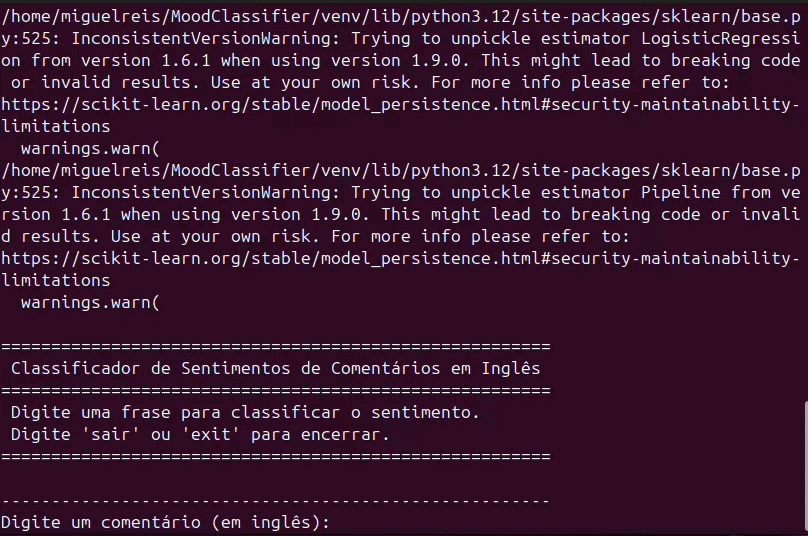
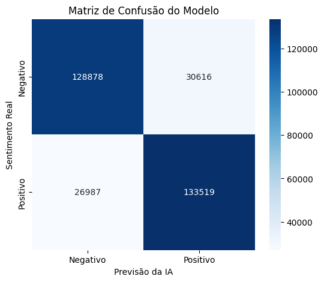

<p align="center">
 
</p>

# 💬 Classificador de Sentimentos em Comentários

Projeto acadêmico desenvolvido para a disciplina de **Exploração Digital e Fundamentos Tecnológicos** da faculdade, com o objetivo de construir um modelo de Machine Learning capaz de classificar automaticamente o sentimento de comentários em inglês como **positivo** ou **negativo**.

---

## 📋 Sobre o projeto

O modelo foi treinado com o dataset **Sentiment140**, contendo 1,6 milhão de tweets em inglês previamente rotulados em negativo ou positivo. O pipeline de classificação consiste em:

1. **Limpeza do texto** — remoção de links, menções e padronização
2. **Vetorização TF-IDF** — conversão do texto em representação numérica, considerando unigramas, bigramas e trigramas, além de salvar até 100 mil termos
3. **Regressão Logística** — algoritmo de classificação que aprende o "peso emocional" de cada termo

O modelo atingiu aproximadamente **82% de acurácia** nos dados de teste (320 mil comentários reservados para validação);
Para melhor visualização, segue abaixo a matriz de confusão do MoodClassifier:

<p align="center">
 
</p>

---

## 🛠️ Tecnologias utilizadas

- [Python 3](https://www.python.org/)
- [scikit-learn](https://scikit-learn.org/) — vetorização TF-IDF e Regressão Logística
- [pandas](https://pandas.pydata.org/) — manipulação dos dados
- [Matplotlib](https://matplotlib.org/) / [Seaborn](https://seaborn.pydata.org/) — visualização da Matriz de Confusão
- [Google Colab](https://colab.research.google.com/) — ambiente de treinamento

---

## ▶️ Como testar

> ⚠️ Ressalto que os comentários precisam ser em inglês

### Opção 1 — Rodar no Google Colab (recomendado)

Abra o notebook diretamente no Colab (o arquivo Classificador_de_Comentario.ipynb), execute todas as células em ordem e use o campo de input ao final para digitar comentários.

> ⚠️ O treinamento leva entre 2 a 4 minutos no Colab.

### Opção 2 — Rodar localmente com o modelo já treinado

Se não quiser esperar o treinamento, baixe o modelo já treinado:

📥 **[Download do modelo (modelo_sentimentos.pkl) — Google Drive](https://drive.google.com/uc?export=download&id=1LlCJ54vKPd9qrUKI0CK64KMSnywQ7NJI)**

Depois, em seu terminal, com o modelo já instalado:
 
* Clone o repositório para sua máquina:
```bash
git clone https://github.com/MiguelReisB/MoodClassifier
cd MoodClassifier
```
* Para criar e ativar o ambiente virtual no Linux/Mac:
```bash
python3 -m venv venv
source venv/bin/activate
```
* Para criar e ativar o ambiente virtual no Windows:
```bash
python3 -m venv venv
venv\Scripts\activate        
```
> Decisão de usar ambiente virtual para que você não precise instalar as dependências diretamente no PC, mas na pasta venv/ ;)
* Instale as dependências:
```bash
pip install scikit-learn
```
#### Lembre-se de colocar o arquivo modelo_sentimentos.pkl nesta mesma pasta
* logo após, execute:
```bash
python classificar.py
```
 
> Toda vez que abrir um terminal novo, ative o ambiente antes com `source venv/bin/activate` (Linux/Mac) ou `venv\Scripts\activate` (Windows). Para sair, digite `deactivate`.

## Frases para você testar

Frases com o sentimento bem definido:

- I absolutely loved this movie!
- This product is amazing, totally worth it.
- I hate this service, it was terrible.
- Worst purchase I've ever made.

Frases com o sentimento um pouco mascarado:

- Well… that could have gone better.
- It's not bad, I guess.
- I expected more from this.
- Could be worse.
- It works... somehow.

---

### Uma breve observação:
Ao testar, veja que ela pode cometer erros - Ela não compreende perfeitamente: ironia, sarcasmo, duplo sentido, construções semanticamente pouco explícitas.

*Inteligência Artificial desenvolvida exclusivamente para fins acadêmicos, nenhuma decisão deve ser tomada com base em seus resultados sem antes realizar uma análise profunda e levar em consideração princípios éticos e legais.*
